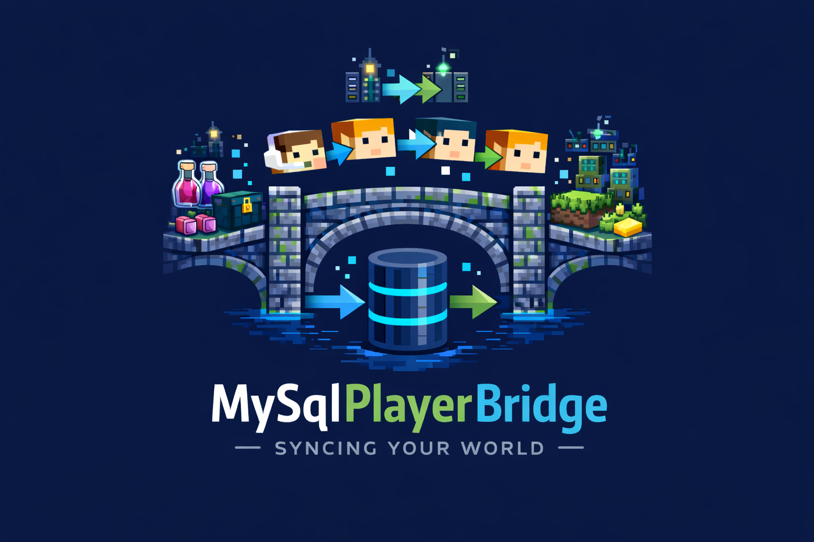

# MySqlPlayerBridge



Modern player data sync for Minecraft servers with MySQL. Built for current Paper/Bukkit and Folia servers, with modular sync and admin tooling. Designed for multi-server setups where a single database should be the source of truth.

## Highlights

- **Folia and Bukkit/Paper compatible** with async-first design.
- **Module-based sync** to enable only what you need.
- **Admin edit tools** to inspect and change player data directly in the database, including GUI editors for inventories.
- **Fail-safe logging** and local error snapshots for troubleshooting and recovery.
- **No-entry protection** to avoid overwriting data from the wrong server.

## Features

- **Cross-server sync** with a shared MySQL database. Each module stores its own table for isolation and safety.
- **Selective modules** (enable only what you want):
  - Inventory
  - Offhand
  - Ender Chest
  - Armor
  - Location
  - Gamemode
  - Experience
  - Health
  - Saturation
  - Economy (Vault)
  - Potion Effects
  - Advancements
  - Statistics
  - Hotbar slot selection
- **Admin commands** for operations and recovery:
  - `/mpb sync` manual sync
  - `/mpb clear` wipe player data
  - `/mpb edit` edit player data (includes GUI inventory editors and direct numeric edits)
- **Automatic sync task** for periodic saving.
- **Error handling** with structured logs and data backups (stored under the plugin folder).

## Installation

1. Download and install **NBTAPI**.
   - Required for inventory, armor, ender chest, and offhand serialization.
2. Put `MySqlPlayerBridge` in your server `plugins/` folder.
3. Start the server once to generate configs.
4. Configure MySQL in `plugins/MySqlPlayerBridge/mysql.yml`.
5. Enable the modules you want in `plugins/MySqlPlayerBridge/config.yml`.
6. Restart the server.

### MySQL Setup (native server)

Create a database and user with minimal privileges. Example for a local MySQL server:

```sql
CREATE DATABASE mpb;
CREATE USER 'mpb_user'@'%' IDENTIFIED BY 'your_password';
GRANT ALL PRIVILEGES ON mpb.* TO 'mpb_user'@'%';
FLUSH PRIVILEGES;
```

Then set `mysql.yml`:

```yaml
host: "127.0.0.1"
port: 3306
database: "mpb"
user: "mpb_user"
password: "your_password"
main-table-name: "player_data"
```

## Admin Edit Feature

The edit system is designed for real-world operations:
- Edit any supported module values directly in the database.
- Inventory, armor, ender chest, and offhand are edited via GUI.
- Numeric fields validate input before saving.
- Offline players can be edited using database entries.

Example:

```
/mpb edit <player> inventory
/mpb edit <player> offhand
/mpb edit <player> location <world> <x> <y> <z> [yaw] [pitch]
/mpb edit <player> exp <value>
/mpb edit <player> exp_level <value>
```

## Requirements

- MySQL or MariaDB
- Java 21
- NBTAPI (required for inventory serialization)
- Vault (optional, for economy sync)

## Languages

Built-in translations:
- English: `src/main/resources/lang/en-us.yml`
- German: `src/main/resources/lang/de-de.yml`
- Chinese: `src/main/resources/lang/zh-cn.yml`

You can submit new translations any time via PR. Keep the key structure and formatting consistent with existing files.

## Notes

- Cross-version syncing between different Minecraft versions is not guaranteed.
- Folia and Bukkit/Paper support remains a core focus.

## License

See `LICENSE`
