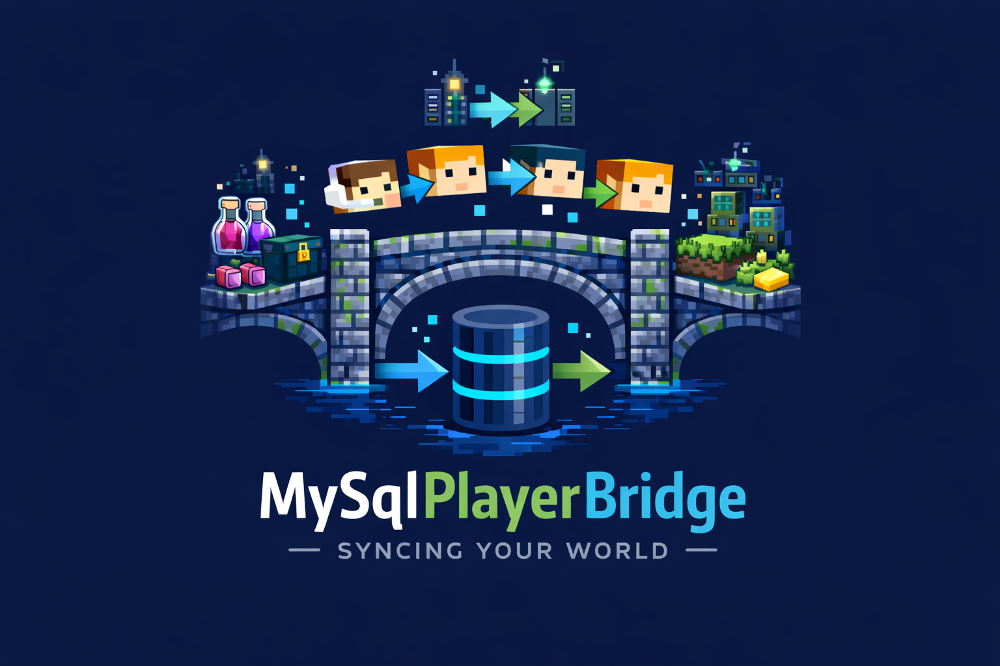

# MySqlPlayerBridge



Modern player data sync for Minecraft servers with MySQL. Built for current Paper/Bukkit and Folia servers, with modular sync and admin tooling. Designed for multi-server setups where a single database should be the source of truth.

## Highlights

- **Paper and Folia compatible** with one shared synchronization pipeline.
- **Session-safe server switching** with runtime UUIDs, per-login tokens and database-clock leases.
- **Bounded pooled database access** through HikariCP; JDBC never runs on a Minecraft tick thread.
- **Module-based sync** to enable only what you need.
- **Admin edit tools** to inspect and change player data directly in the database, including GUI editors for inventories.
- **Fail-safe logging** and local error snapshots for troubleshooting and recovery.
- **No-entry protection** to avoid overwriting data from the wrong server.

## Features

- **Cross-server sync** with a shared MySQL database. Each module stores its own table for isolation and safety.
- **Selective modules** (enable only what you want):
  - Inventory
  - Offhand
  - Ender Chest
  - Armor
  - Location
  - Gamemode
  - Experience
  - Health
  - Saturation
  - Economy through Vault
  - Potion Effects
  - Advancements
  - Statistics
  - Hotbar slot selection
- **Admin commands** for operations and recovery:
  - `/mpb sync` manual sync
  - `/mpb clear` wipe player data
  - `/mpb edit` edit player data (includes GUI inventory editors and direct numeric edits)
- **Automatic sync task** for periodic saving.
- **Error handling** with structured logs and data backups (stored under the plugin folder).

## Installation

1. Download and install **NBTAPI**.
   - Required for inventory, armor, ender chest, and offhand serialization.
2. Put `MySqlPlayerBridge` in your server `plugins/` folder.
3. Start the server once to generate configs.
4. Configure MySQL in `plugins/MySqlPlayerBridge/mysql.yml`.
5. Enable the modules you want in `plugins/MySqlPlayerBridge/config.yml`.
6. Restart the server.

### MySQL persistence

MySqlPlayerBridge uses its own HikariCP connection pool with the MariaDB JDBC
driver (compatible with MySQL and MariaDB). Enabled player modules are stored
as one snapshot in a transaction on a bounded database executor, so JDBC work
does not run on Paper or Folia tick threads. Runtime UUIDs, login session tokens
and short database leases coordinate ownership safely, including copied server
templates with identical names.

### MySQL Setup (native server)

Create a database and user with minimal privileges. Example for a local MySQL server:

```sql
CREATE DATABASE mpb;
CREATE USER 'mpb_user'@'%' IDENTIFIED BY 'your_password';
GRANT ALL PRIVILEGES ON mpb.* TO 'mpb_user'@'%';
FLUSH PRIVILEGES;
```

Then set `mysql.yml`:

```yaml
host: "127.0.0.1"
port: 3306
database: "mpb"
user: "mpb_user"
password: "your_password"
main-table-name: "player_data"
```

## Admin Edit Feature

The edit command lets administrators correct player data without needing the player to be online. You can change values such as experience, health, food, game mode, location, and money. Inventories, armor, and ender chests open in an in-game editor so they can be changed safely by hand.

Player names and available values can be selected with tab completion. To apply the same value to every player, use `*` instead of a name. Players who are currently active on another server are left unchanged and reported in the result.

Examples:

```
/mpb edit Steve exp 0.5
/mpb edit Steve gamemode creative
/mpb edit Steve inventory
/mpb edit * food_level 20
```
## Requirements

- Paper or Folia
- MySQL or MariaDB
- Java 21
- NBTAPI (required for inventory serialization)
- Vault plus an economy provider (only when economy sync is enabled)

## Languages

Built-in translations:
- English: `src/main/resources/lang/en-us.yml`
- German: `src/main/resources/lang/de-de.yml`
- Chinese: `src/main/resources/lang/zh-cn.yml`

You can submit new translations any time via PR. Keep the key structure and formatting consistent with existing files.

## Notes

- Cross-version syncing between different Minecraft versions is not guaranteed.
- Paper and Folia support are equal core targets.

## License

See `LICENSE`
